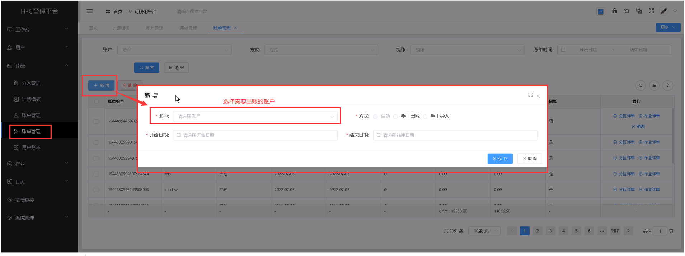
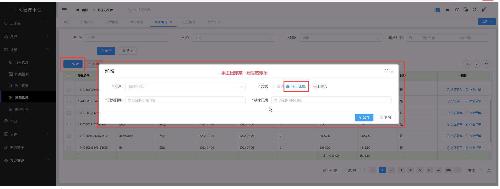
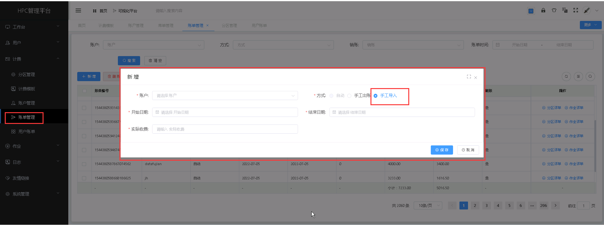
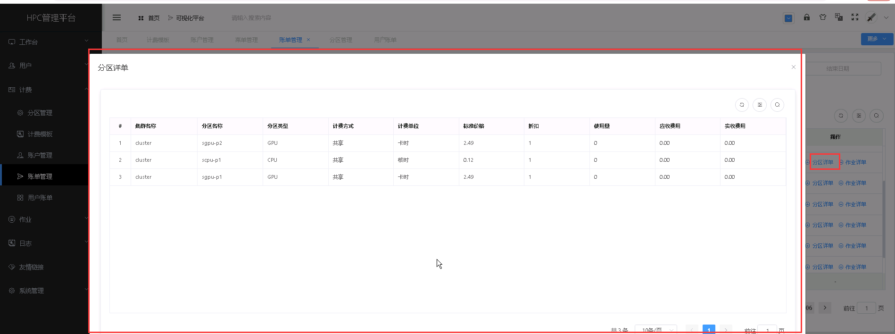
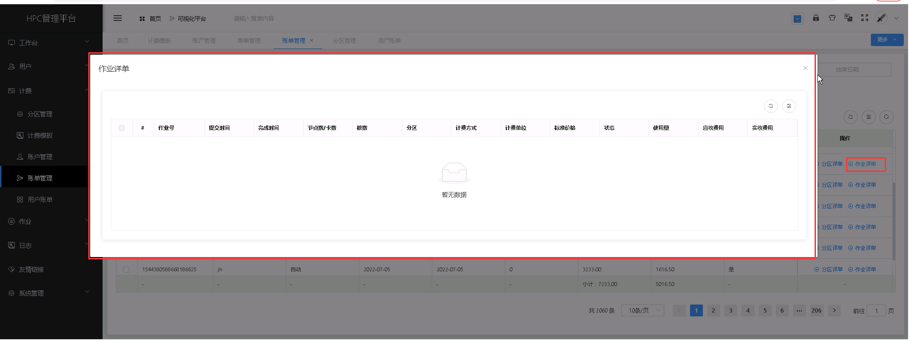
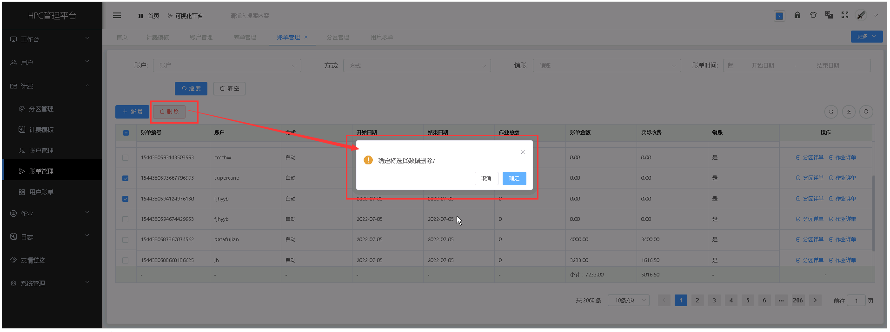

账单管理
======================

> **系统管理员可以查看全部账户的账单，团队管理员可以查看本账户的账单**

## 新增账单 ##
* 点击【**计费**】菜单，再次点击[**账单管理**]，进入'账单管理'列表页面，点击<**新增**>按钮，填入账单信息，点击<**保存**>，可成功添加账单。

> **包括三种方式的账单：每日自动生成、手工出账、手工导入；自动生成、 手工出账有详细使用信息，手工导入仅提供实收费用。**

+ **手工出账:** 基于历史使用详单，根据账户的设置（计费模板、产品折扣）， 手工生成账单。

+ **手工导入:** 支持管理员按照账户手工导入某一个周期内的总的应收费用 （元），不包含具体使用细节

&emsp;

----------------------------------------------------------------------------------------------------------------------------------
## 查看分区详单 ##

* 点击【**计费**】菜单，再次点击[**账单管理**]，进入'账单管理'列表页面，点击需要查看的账单管理项中的[**操作**]列的<**分区详单**>按钮，可成功查看分区详单信息。

&emsp;

----------------------------------------------------------------------------------------------------------------------------------

## 作业详单 ##

* 点击【**计费**】菜单，再次点击[**账单管理**]，进入'账单管理'列表页面，点击需要查看的账单管理项中的[**操作**]列的<**作业详单**>按钮，成功查看该账单的作业详单。

&emsp;

----------------------------------------------------------------------------------------------------------------------------------

## 删除账单 ##

* 点击【**计费**】菜单，再次点击[**账单管理**]，进入'账单管理'列表页面，勾选需要删除的账单管理项，再点击<**删除**>按钮，进行批量删除的操作。

&emsp;

