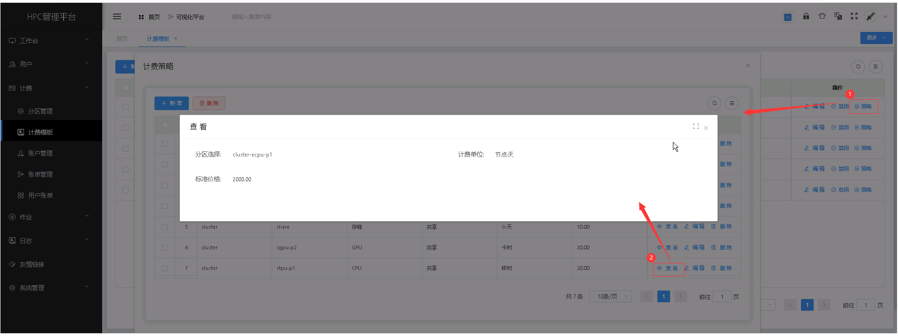

计费模板
======================
&emsp;

+ **计费模板设置所有可用分区的基础价格。**
+ **计费模板仅新增、禁用，不可修改、删除，方便回溯。**
+ **针对同一分区不同价格，需设置多套计费模板。**

&emsp;

## 新增计费模板 ##
* 点击【**计费**】菜单，再次点击[**计费模板**]，进入'计费模板'列表页面，点击<**新增**>按钮，填入计费模板信息，点击<**保存**>，可成功添加计费模板。

&emsp;

----------------------------------------------------------------------------------------------------------------------------------

## 编辑计费模板 ##

* 点击【**计费**】菜单，再次点击[**计费模板**]，进入'计费模板'列表页面，点击需要编辑的计费模板项中的[**操作**]列的<**编辑**>按钮，填入新的计费模板信息，点击<**修改**>，可成功编辑计费模板。

&emsp;

----------------------------------------------------------------------------------------------------------------------------------

## 禁用计费模板 ##

* 点击【**计费**】菜单，再次点击[**计费模板**]，进入'计费模板'列表页面，点击需要禁用的未被使用的计费模板项中的[**操作**]列的<**禁用**>按钮，可成功禁用模板，禁用后列表内该模板的状态为不可用；点击已被禁用的模板的[**操作**]列的<**启用**>按钮，可成功启用模板，启用后列表内该模板的状态为可用
    * 已被使用的计费模板无法被禁用；

&emsp;

----------------------------------------------------------------------------------------------------------------------------------
## 计费策略 ##

* 点击【**计费**】菜单，再次点击[**计费模板**]，进入'计费模板'列表页面，点击需要操作的计费模板项中的[**操作**]列的<**策略**>按钮，进入计费策略列表，可以对被选计费模板的计费策略进行操作。

### 新增计费策略 ###
* 在'计费策略'列表页面，点击<**新增**>按钮，填入计费策略信息，点击<**保存**>，可成功添加计费策略。

&emsp;

----------------------------------------------------------------------------------------------------------------------------------
### 查看计费策略详情 ###

* 在'计费策略'列表页面，点击需要查看的计费策略管理项中的[**操作**]列的<**查看**>按钮，可成功查看计费策略项详情信息。

&emsp;

----------------------------------------------------------------------------------------------------------------------------------

### 编辑计费策略 ###

* 在'计费策略'列表页面，点击需要编辑的计费策略管理项中的[**操作**]列的<**编辑**>按钮，填入新的计费策略信息，点击<**修改**>，可成功编辑计费策略。

&emsp;

----------------------------------------------------------------------------------------------------------------------------------

### 删除计费策略管理 ###

* 在'计费策略'列表页面，点击需要删除的计费策略管理项中的[**操作**]列的<**删除**>按钮进行删除操作；也可以勾选需要删除的计费策略管理项，再点击<**删除**>按钮，进行批量删除的操作。

&emsp;

