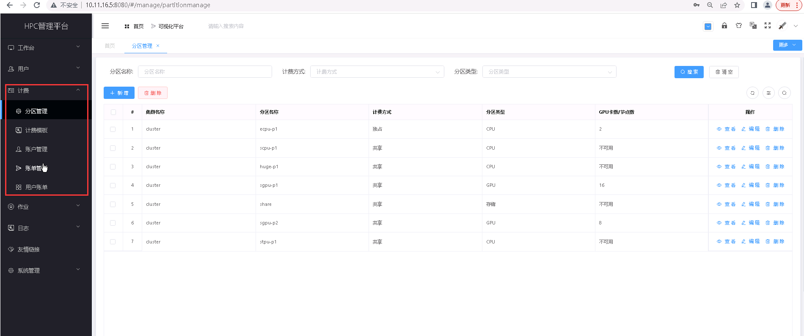
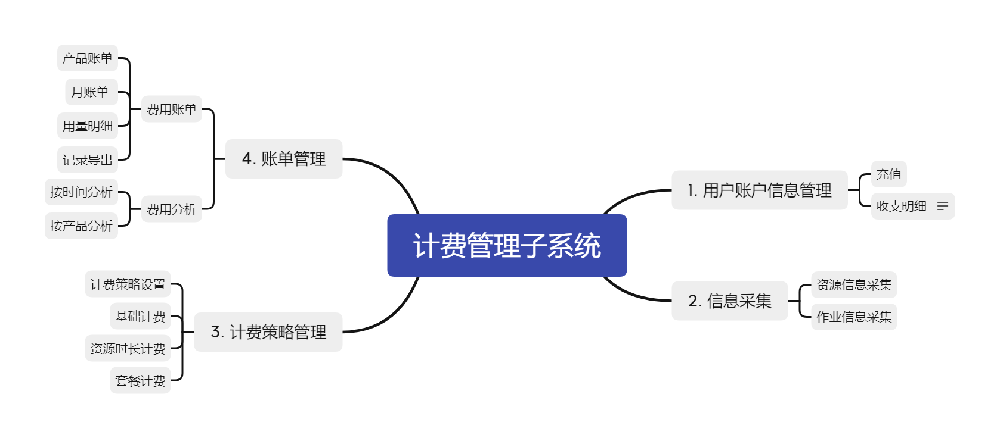
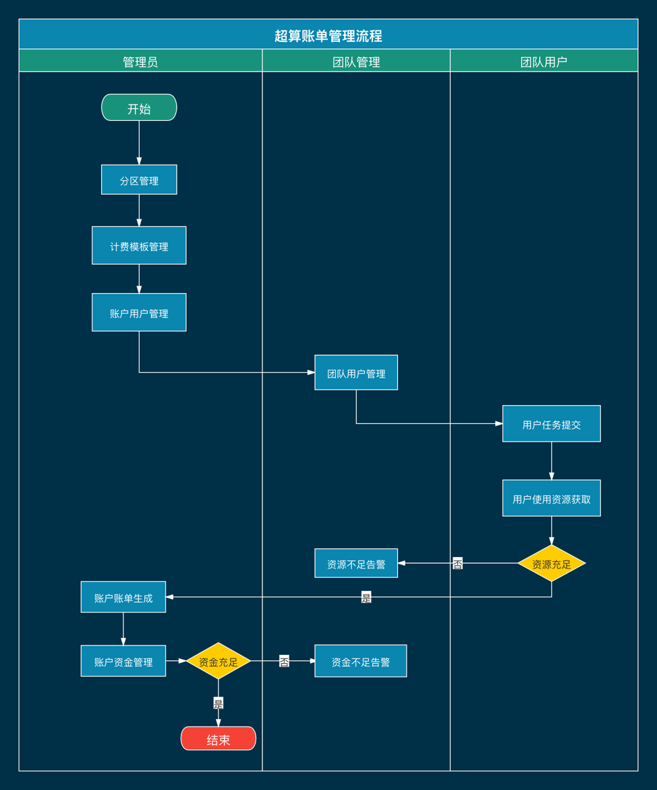

计费
===========================

..

   **计费管理子系统对用户实现配额控制和计费功能，HPC 平台按照用户使用 CPU、GPU、内存的具体数量进行计费，提供对用户使用机时资源进行计费。**

**计费管理功能图：**

..

   **具体功能包括：**

   **(一)用户账户信息管理模块** 
   
   [点击快速访问 :doc:`./user` 模块]

   * （1）用户账户信息管理模块包括账户收支明细查询功能等；

   * （2）系统管理员有权限为系统中的用户（普通用户、团队管理员）进行充值操作；

   * （3）团队管理员有权限查询团队及其成员的账户收支明细，个人用户有权限查询自己的账户收支明细。

   **(二)信息采集模块**

   * （1）信息采集模块包括资源信息采集及统计和作业信息采集功能；

   * （2）系统通过对资源使用信息和作业信息进行采集，作为计费计算依据。

   **(三)计费策略管理模块**
   
   [点击快速访问 :doc:`./charging` 模块]

   * （1）计费策略管理模块包括计费策略设置和资源计费等功能；

   * （2）系统管理员有权限在计费策略管理模块设置各个资源分区的计费规则；

   * （3）系统根据各个资源分区的计费策略及采集到的资源使用时长、用量等情况进行计费计算，对账户进行计费。

   **(四)账单管理模块**  

   [点击快速访问 :doc:`./bill` 模块& :doc:`./userBill` 模块]

   * （1）团队管理员和个人用户有权限查询账户的产品账单，查询历史账单等操作；

   * （2）团队管理员和个人用户有权限对账户费用使用用量明细，包括查询使用明细等操作。

**账单管理流程如下所示：**

.. toctree::
   :maxdepth: 1
   :hidden:

   partition
   charging
   user
   bill
   userBill