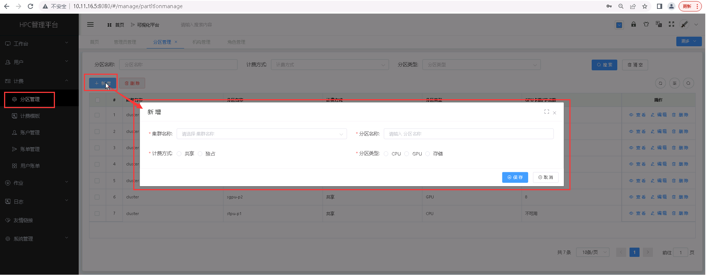
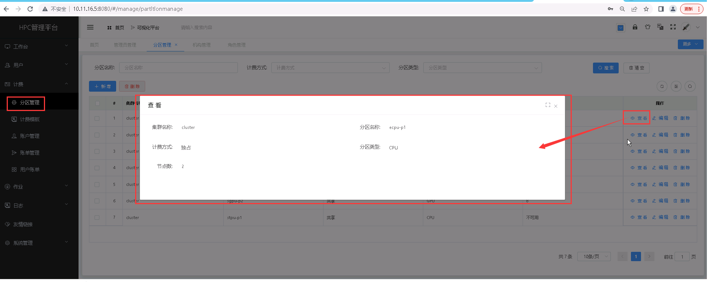
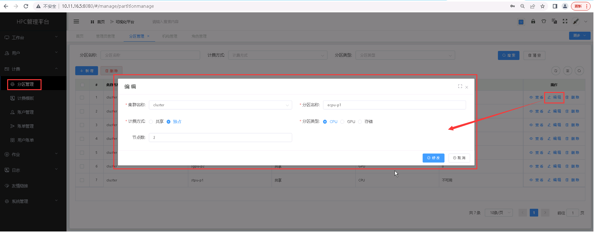
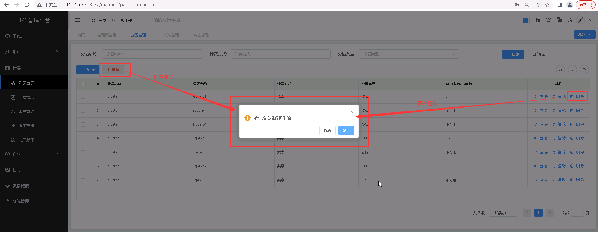

分区管理
======================

> **此处的分区为一个相对广义的概念。正常情况下，分区是指 Slurm 集群的实际可用的计算节点合集，此处将含义扩大，包括节点外接的存储。**

## 新增分区 ##
* 点击【**计费**】菜单，再次点击[**分区管理**]，进入'分区管理'列表页面，点击<**新增**>按钮，填入分区信息，点击<**保存**>，可成功添加分区。

> **注意事项：** 
    > + *新增分区时，注意分区名称需与 slurm 平台中的分区名称一致。*
    > + *计费方式：独占、共享；当为“独占”时，需要设置分区可用节点数。*
    > + *分区类型：CPU、GPU、存储；当选择 GPU 时，需要设置分区可用 GPU 卡数。*
    > + *特别注意：分区名必须是小写。*

&emsp;

----------------------------------------------------------------------------------------------------------------------------------
## 查看分区详情 ##

* 点击【**计费**】菜单，再次点击[**分区管理**]，进入'分区管理'列表页面，点击需要查看的分区管理项中的[**操作**]列的<**查看**>按钮，可成功查看分区项详情信息。

&emsp;

----------------------------------------------------------------------------------------------------------------------------------

## 编辑分区 ##

* 点击【**计费**】菜单，再次点击[**分区管理**]，进入'分区管理'列表页面，点击需要编辑的分区管理项中的[**操作**]列的<**编辑**>按钮，填入新的分区信息，点击<**修改**>，可成功编辑计费模板。

&emsp;

----------------------------------------------------------------------------------------------------------------------------------

## 删除分区管理 ##

* 点击【**计费**】菜单，再次点击[**分区管理**]，进入'分区管理'列表页面，点击需要删除的分区管理项中的[**操作**]列的<**删除**>按钮进行删除操作；也可以勾选需要删除的分区管理项，再点击<**删除**>按钮，进行批量删除的操作。

&emsp;