账户管理
======================
&emsp;

**账户管理针对账户基本信息进行设置。**

+ 同一单位/团队共用同一账户进行计费;

&emsp;

+ 在计费模板的基础价格上，设置不同账户、不同产品的折扣;

&emsp;

+ 自动出账是，即每天自动生成账单；如果为否，则表示该账户免出账单，每天仅生成使用详单，需要手工出账或手工导入。

## 新增账户 ##

**设置账户名称、所在集群、默认存储、可用 GPU 卡数等信息。**

* 点击【**计费**】菜单，再次点击[**账户管理**]，进入'账户管理'列表页面，点击<**新增**>按钮，填入账户信息，点击<**保存**>，可成功添加账户。

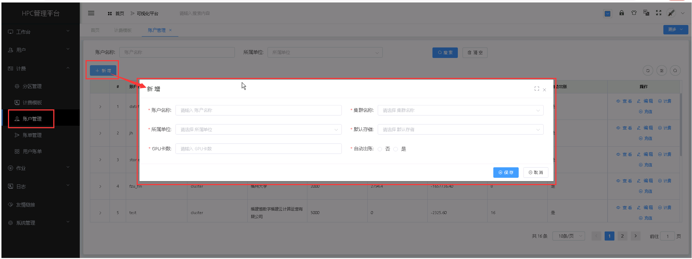

&emsp;

----------------------------------------------------------------------------------------------------------------------------------
## 查看账户详情 ##

* 点击【**计费**】菜单，再次点击[**账户管理**]，进入'账户管理'列表页面，点击需要查看的账户管理项中的[**操作**]列的<**查看**>按钮，可成功查看账户项详情信息。

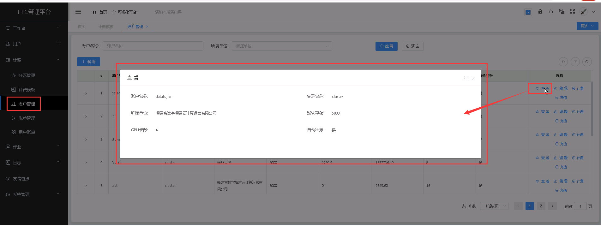

&emsp;

----------------------------------------------------------------------------------------------------------------------------------

## 编辑账户 ##

* 点击【**计费**】菜单，再次点击[**账户管理**]，进入'账户管理'列表页面，点击需要编辑的账户管理项中的[**操作**]列的<**编辑**>按钮，填入新的账户信息，点击<**修改**>，可成功编辑计费模板。

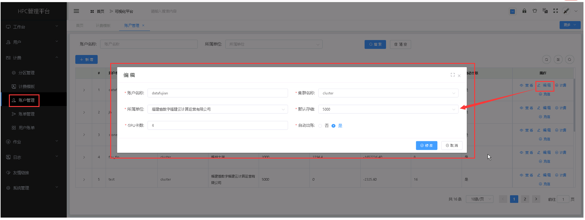

&emsp;

----------------------------------------------------------------------------------------------------------------------------------

## 计费设置 ##

**针对账户选择计费模板，可设置不同账户的计费折扣，可以设置生效日期； 在生效期内，以当前模板进行计费，生效期后，以新的模板进行计费。**

* 点击【**计费**】菜单，再次点击[**账户管理**]，进入'账户管理'列表页面，点击需要设置计费的账户项中的[**操作**]列的<**计费**>按钮进行计费设置，可设置可用的账户及账户的计费折扣。

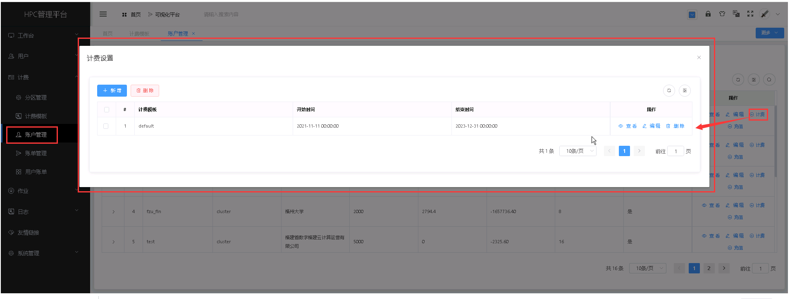

&emsp;

---------------------------------------------------------------------------------------------------------------------------------
### 新增计费 ###
* 在'计费设置'列表页面，点击<**新增**>按钮，填入计费设置信息，点击<**保存**>，可成功添加计费设置。

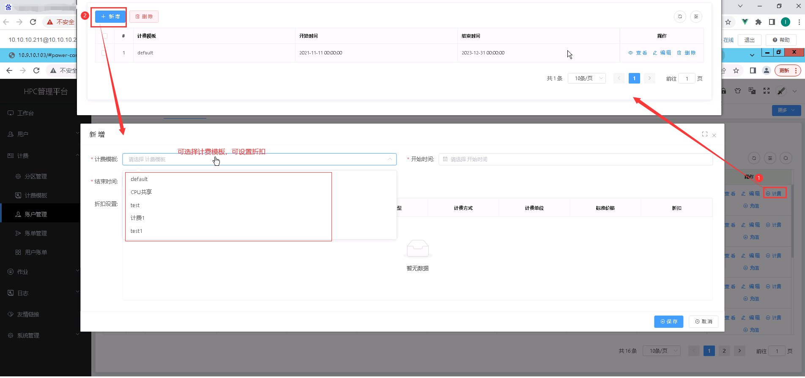

&emsp;

----------------------------------------------------------------------------------------------------------------------------------
### 查看计费设置详情 ###

* 在'计费设置'列表页面，点击需要查看的计费设置管理项中的[**操作**]列的<**查看**>按钮，可成功查看计费设置项详情信息。

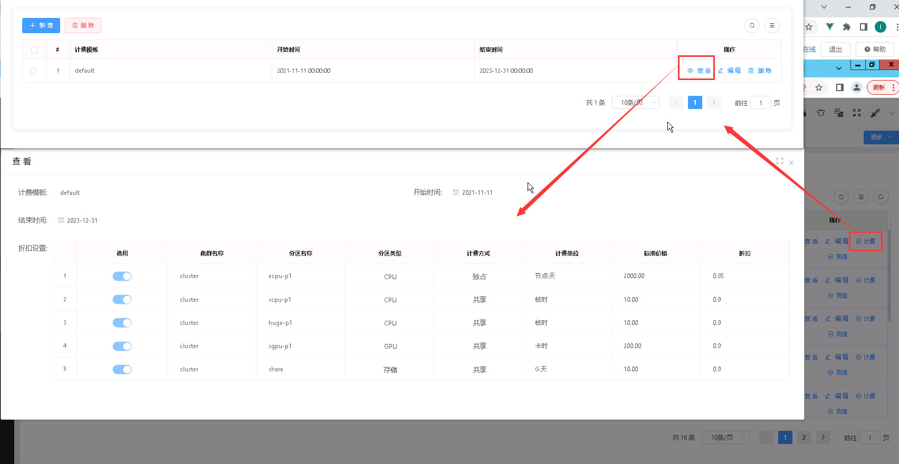

&emsp;

----------------------------------------------------------------------------------------------------------------------------------

### 编辑计费设置 ###

* 在'计费设置'列表页面，点击需要编辑的计费设置管理项中的[**操作**]列的<**编辑**>按钮，填入新的计费设置信息，点击<**修改**>，可成功编辑计费设置。

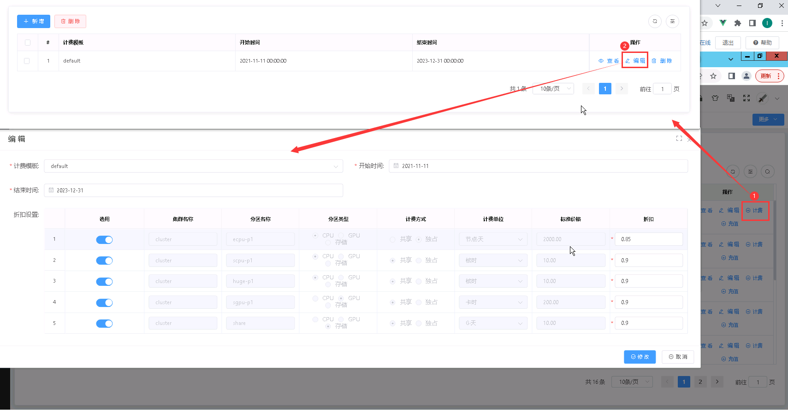

&emsp;

----------------------------------------------------------------------------------------------------------------------------------

### 删除计费设置管理 ###

* 在'计费设置'列表页面，点击需要删除的计费设置管理项中的[**操作**]列的<**删除**>按钮进行删除操作；也可以勾选需要删除的计费设置管理项，再点击<**删除**>按钮，进行批量删除的操作。

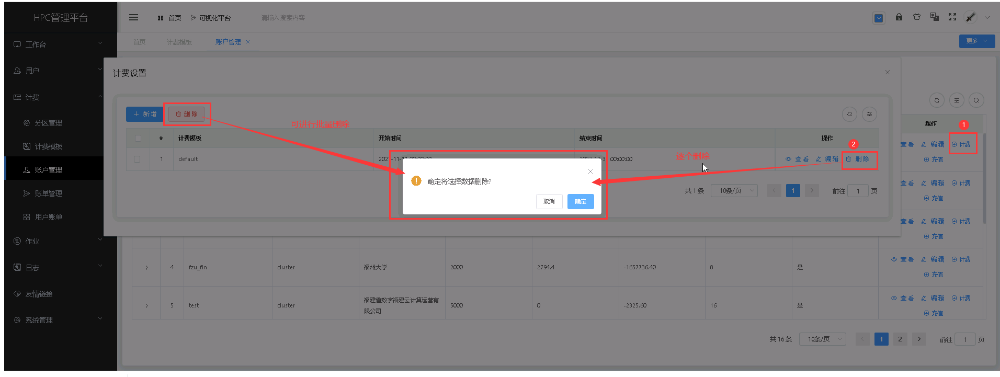

&emsp;

## 账户充值 ##

**可针对账户进行充值，如果需要扣费，可直接输入负数。**

* 点击【**计费**】菜单，再次点击[**账户管理**]，进入'账户管理'列表页面，点击需要充值的账户管理项中的[**操作**]列的<**充值**>按钮，进入'资金管理'页面，点击<**充值**>按钮，填入充值信息，点击<**保存**>，可成功充值。

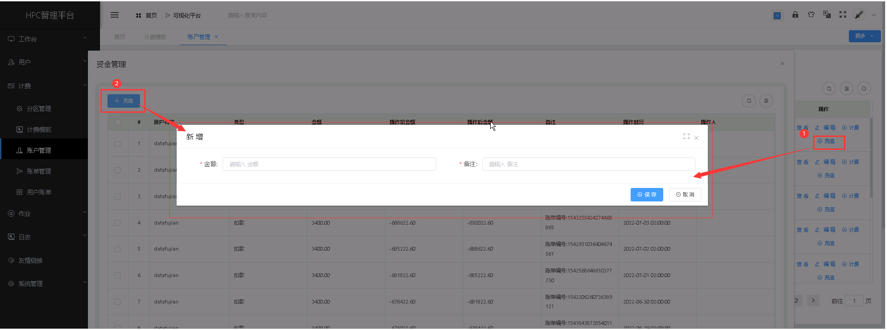

&emsp;

----------------------------------------------------------------------------------------------------------------------------------

## 用户管理 ##

**账户添加以后，可在账户下面添加相应用户。管理员可以新增团队管理员， 特殊情况下新增团队用户；团队管理员可以新增团队用户。**

* 点击需要添加用户的账户左侧> 按钮可查看该账户下的用户信息列表。

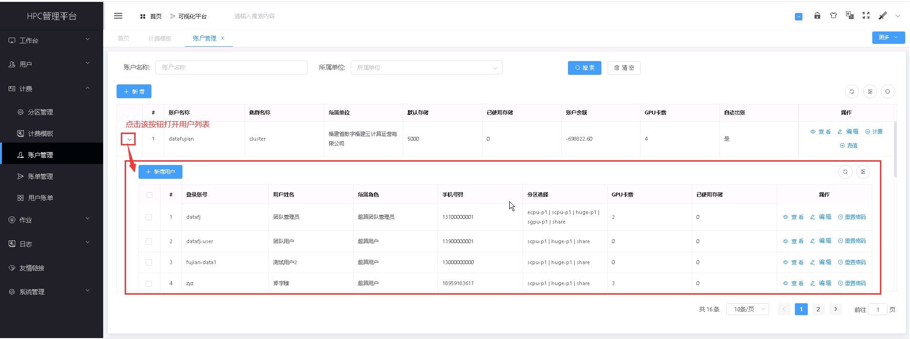

+ 注意事项：
    + *当选择 GPU 账户时，可以设置用户可用的 GPU 卡数；用户的可用账户及 GPU 卡数，在账户的可用数量范围内。*
    + *团队管理员也可以新增团队用户。*

### 新增用户管理 ###
* 在'用户管理'列表页面，点击<**新增**>按钮，填入用户管理信息，点击<**保存**>，可成功添加用户。

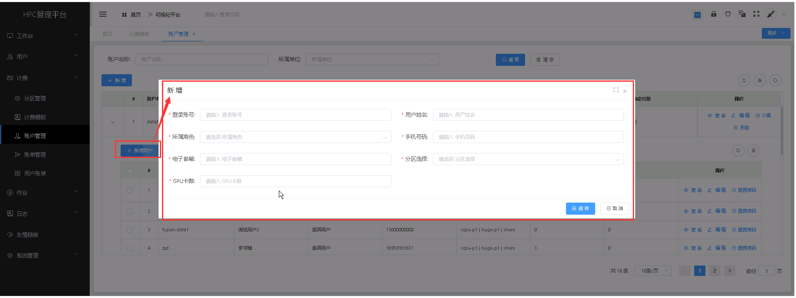

&emsp;

----------------------------------------------------------------------------------------------------------------------------------
### 查看用户详情 ###

* 在'用户管理'列表页面，点击需要查看的用户管理管理项中的[**操作**]列的<**查看**>按钮，可成功查看用户项详情信息。

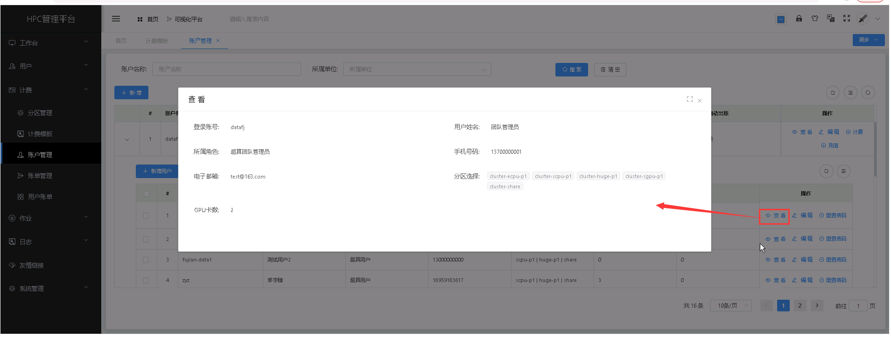

&emsp;

----------------------------------------------------------------------------------------------------------------------------------

### 编辑用户 ###

* 在'用户管理'列表页面，点击需要编辑的用户管理管理项中的[**操作**]列的<**编辑**>按钮，填入新的用户信息，点击<**修改**>，可成功编辑用理。

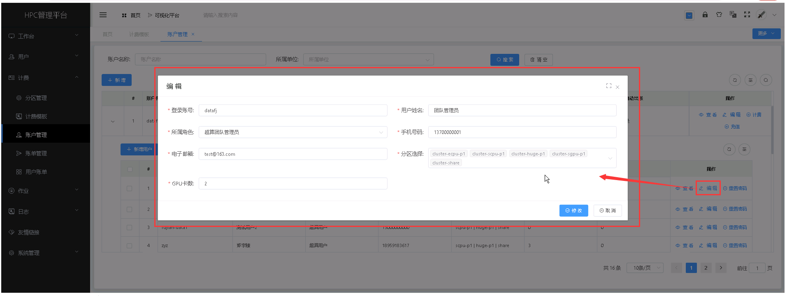

&emsp;

----------------------------------------------------------------------------------------------------------------------------------

### 重置用户密码 ###

+ **管理员和团队管理员可以重置用户的密码。**

* 在'用户管理'列表页面，点击需要重置密码的用户项中的[**操作**]列的<**重置密码**>按钮进行用户密码重置的操作。

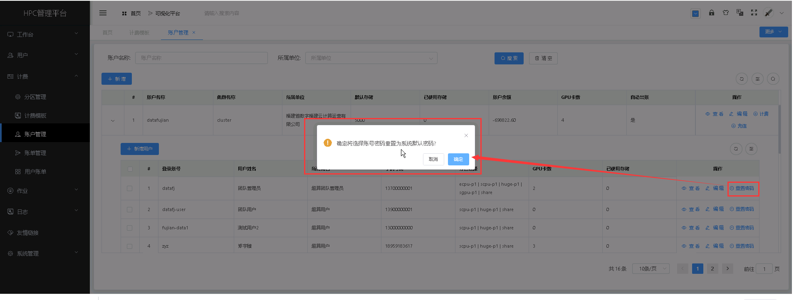

&emsp;

