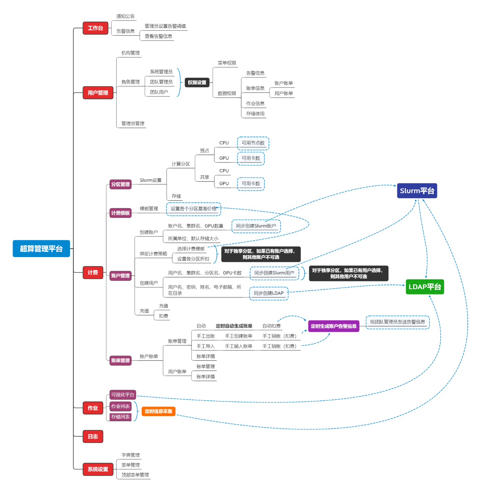

平台体系结构
======================
&emsp;
**HPC管理平台总体系统架构设计如下图所示：**

&emsp;

------------------------------------------------------------------------------------------------------------------------------

平台功能模块
======================
&emsp;
* **用户管理**
    + *对机构、角色以及管理员的管理，同时可以设置不同用户角色的**菜单权限**和**数据权限***。

&emsp;
* **计费管理**
    + *统对用户实现**配额控制**和**计费功能**，HPC平台按照用户使用CPU、GPU、内存的具体数量进行计费，提供对用户使用机时资源进行计费*。

&emsp;
* **作业管理**
    + *主要对作业信息以及存储使用信息进行管理*。

&emsp;

--------------------------------------------------------------------------------------------------------------------------------

HPC可视化平台
======================
&emsp;

主要实现对 HPC 平台的可视化使用，集成 Web Shell、 文件管理、 作业提交、 可视化应用等一站式服务，可以**在线提交与管理作业任务、在线通过命令行访问服务器等**。

&emsp;

--------------------------------------------------------------------------------------------------------------------------------

平台访问信息
======================
&emsp;

| 序号  | 用途      | 地址                  | 管理账号                             |备注                      |
|:-----:| :-------- | ---------------------:| :-----------------------------------:|:------------------------:|
|   1   |Web管理平台|http://10.11.16.5:8080/| 默认管理员账号：admin，默认密码：admin|团队管理员：datafj/666666|
|   2   |可视化平台 |http://10.9.0.1/       | 跟团队管理与和 团队用户用户名 密码一致|                         |

