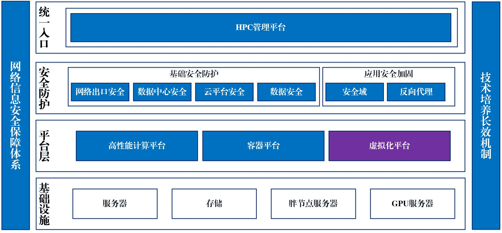

平台实施架构
======================
&emsp;
> **实施架构如下图所示：**

>

   +  **基础设施层** 主要是提供服务器、胖节点服务器、GPU服务器以及存储等硬件资源，硬件资源利用业主方已有资源。
   +  **平台层** 主要针对硬件资源进行池化，一期进行高性能计算平台的建设，利用高性能计算和容器技术，实现高性能计算资源的调度；二期可进行虚拟化平台的建设，支持对云计算资源池进行虚拟化，为特定用户提供Windows桌面应用环境，开展相关高性能计算任务。
   +  **安全防护层** 主要为平台提供相关的安全防护能力，包括网络安全、系统安全安全及数据安全等层面的安全防护，可基于业主方现有安全防护体系。本项目中将搭建单独的反向代理系统，为平台提供反向代理、负载均衡以及SSL证书卸载等能力。
   +  **平台将为用户提供统一入口** 基于浏览器进行访问的HPC管理平台，实现用户管理、计费管理、高性能计算任务管理、运维管理等功能。

&emsp;

------------------------------------------------------------------------------------------------------------------------------

平台功能模块
======================
&emsp;
* **用户管理**&emsp;([点击快速访问'用户管理'模块](../userManagement/index.rst))
    <!-- + *对机构、角色以及管理员的管理，同时可以设置不同用户角色的**菜单权限**和**数据权限***。 -->
    + [机构](../userManagement/org.md)、[角色](../userManagement/role.md)以及[管理员](../userManagement/administrator.md)的管理，同时可以设置不同用户角色的 **菜单权限** 和 **数据权限**。

&emsp;
* **计费管理**&emsp;([点击快速访问'计费管理'模块](../charging/index.rst))
    + *统对用户实现 **配额控制** 和 **计费功能** ，HPC平台按照用户使用 **CPU**、**GPU**、 **内存** 的具体数量进行计费，提供对用户使用时资源进行计费*。

&emsp;
* **作业管理**&emsp;([点击快速访问'作业管理'模块](../task/index.rst))
    + *主要对作业信息以及存储使用信息进行管理*。

&emsp;

--------------------------------------------------------------------------------------------------------------------------------

HPC可视化平台
======================
&emsp;

主要实现对 HPC 平台的可视化使用，集成 ** Web Shell**、**文件管理**、** 作业提交**、** 可视化应用** 等一站式服务，可以 **在线提交与管理作业任务、在线通过命令行访问服务器** 等。&emsp;([点击快速访问'可视化平台'模块](../visualization/index.rst))

&emsp;

--------------------------------------------------------------------------------------------------------------------------------

平台访问信息
======================
&emsp;

| 序号  | 用途      | 地址                  |备注                      |
|:-----:| :-------- | ---------------------:|:------------------------:|
|   1   |Web管理平台|<http://10.11.16.5:8080/>|                        |
|   2   |可视化平台 |<http://10.9.0.1/>       |                         |

