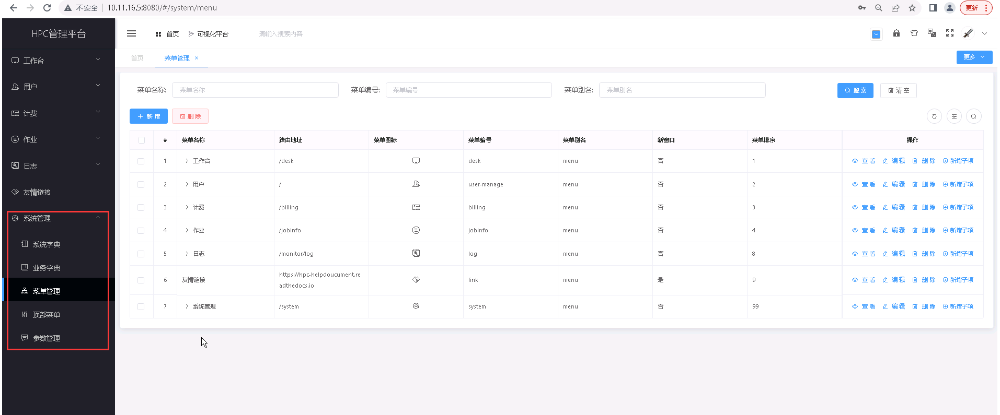

系统配置
===========================

..

   **系统配置主要对系统的相关设置项进行初始化设置，包括数据字典、菜单 和参数设置等。其中包括：**

   + **系统字典** 是对系统的常用项进行设置；
      * 点击快速访问 :doc:`./systemDictionary` 模块

   + **业务字典** 是对系统的业务项进行设置，目前平台的业务字典设置了‘默认密码项’；
      * 点击快速访问 :doc:`./businessDictionary` 模块

   + **菜单管理** 主要对系统的显示菜单进行设置；
      * 点击快速访问 :doc:`./menu` 模块

   + **顶部菜单** 主要对系统的顶部菜单进行设置；
      * 点击快速访问 :doc:`./topMenu` 模块

   + **参数设置** 主要针对一些默认参数进行设置。
      * 点击快速访问 :doc:`./param` 模块

.. toctree::
   :maxdepth: 1
   :hidden:

   systemDictionary
   businessDictionary
   menu
   topMenu
   param