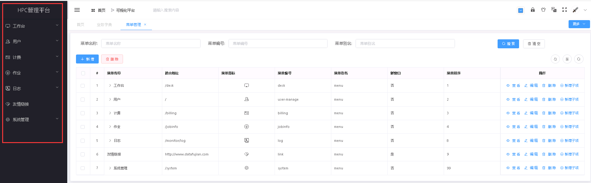
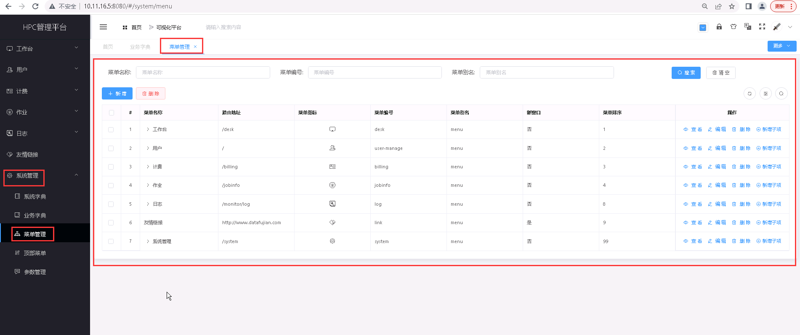
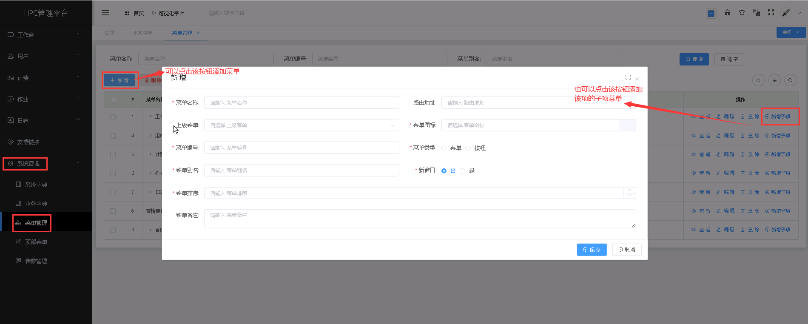
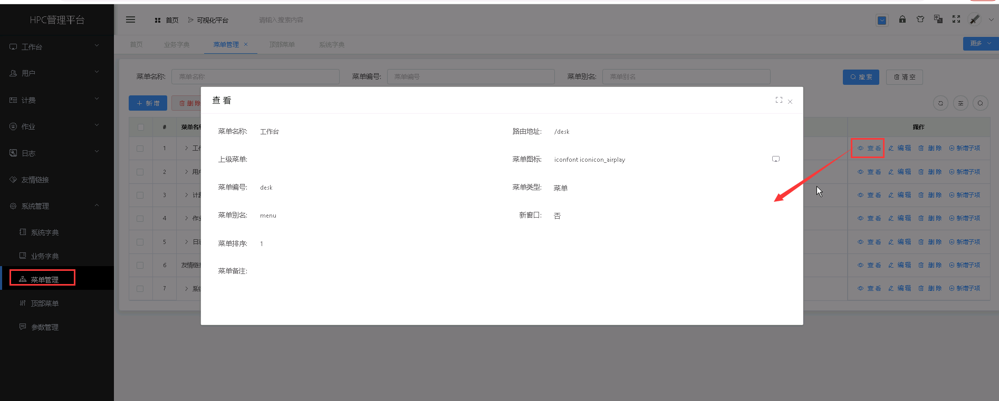
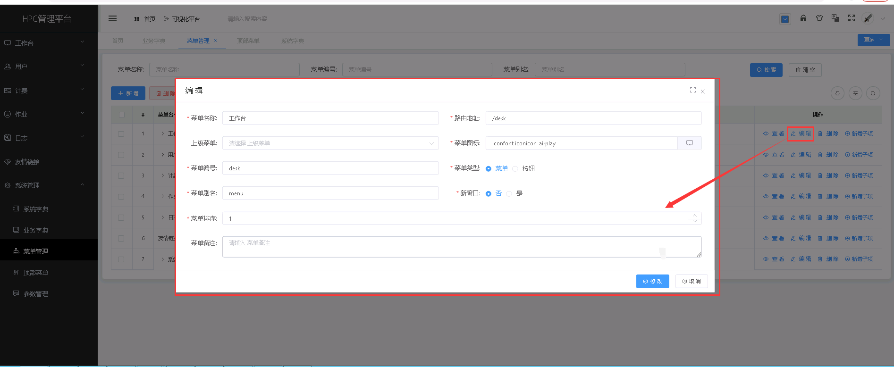
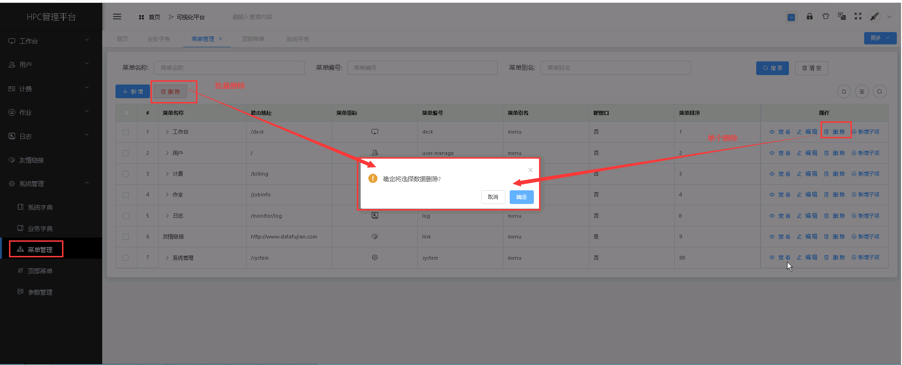

菜单管理
===================================
&emsp;

+ **菜单管理主要对系统的显示菜单进行设置，可设置页面左边的菜单项。**

&emsp;

## 菜单管理列表 ##

&emsp;

----------------------------------------------------------------------------------------------------------------------------------

## 新增菜单 ##
* 点击【**系统管理**】菜单，再次点击[**菜单管理**]，进入'菜单'列表页面，点击<**新增**>按钮或者是点击操作中的<**新增子项**>按钮，填入菜单信息，点击<**保存**>，可成功添加菜单。

&emsp;

----------------------------------------------------------------------------------------------------------------------------------

## 查看菜单详情 ##

* 点击【**系统管理**】菜单，再次点击[**菜单管理**]，进入'菜单管理'列表页面，点击需要查看的菜单项中的[**操作**]列的<**查看**>按钮，可成功查看菜单项详情信息。

&emsp;

----------------------------------------------------------------------------------------------------------------------------------

## 编辑菜单 ##

* 点击【**系统管理**】菜单，再次点击[**菜单管理**]，进入'菜单管理'列表页面，点击需要编辑的菜单项中的[**操作**]列的<**编辑**>按钮，填入新的菜单信息，点击<**修改**>，可成功编辑菜单。

&emsp;

----------------------------------------------------------------------------------------------------------------------------------

## 删除菜单 ##

* 点击【**系统管理**】菜单，再次点击[**菜单管理**]，进入'菜单管理'列表页面，点击需要删除的菜单项中的[**操作**]列的<**删除**>按钮进行删除操作；也可以勾选需要删除的菜单项，再点击<**删除**>按钮，进行批量删除的操作。

&emsp;
