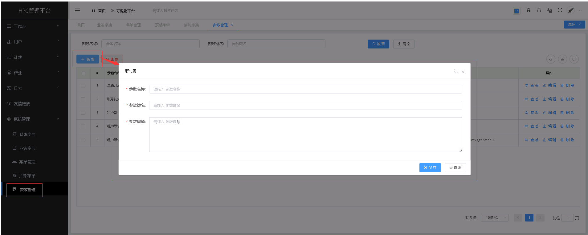
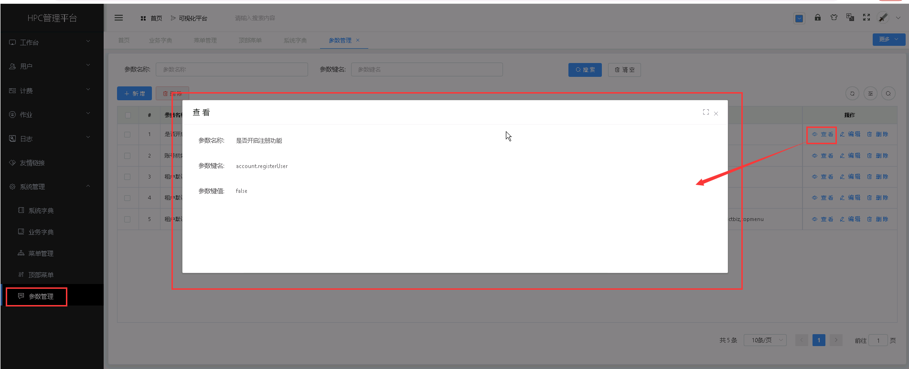
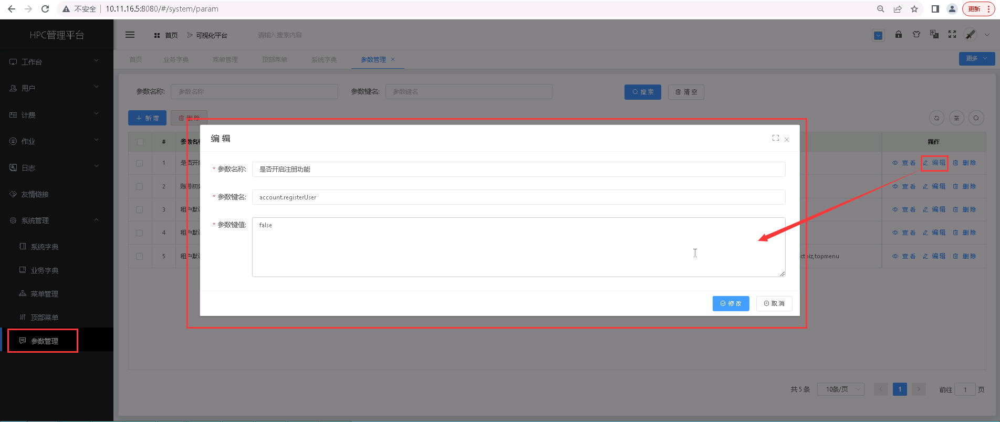
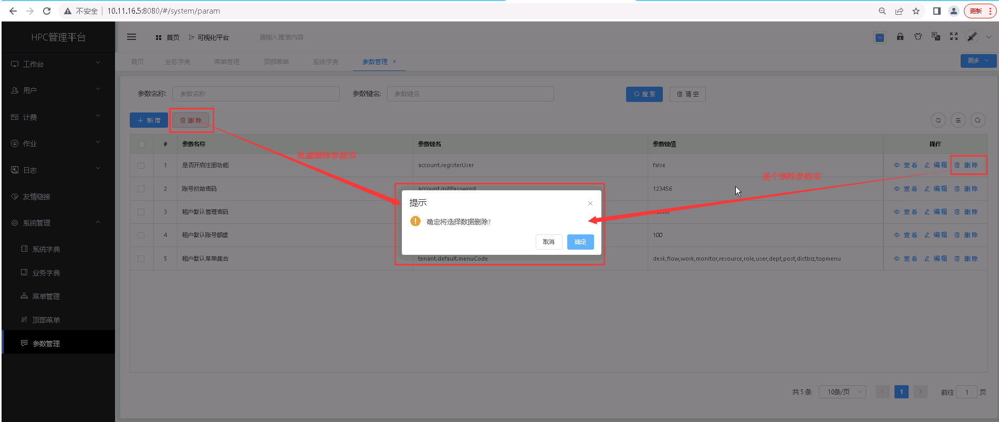

参数设置
===================================

> **主要针对一些默认参数进行设置，使用到包括账号初始密码、默认管理密码等项。**

## 新增参数项 ##
* 点击【**系统管理**】菜单，再次点击[**参数管理**]，进入'参数管理'列表页面，点击<**新增**>按钮按钮，填入参数信息，点击<**保存**>，可成功添加参数。

&emsp;

----------------------------------------------------------------------------------------------------------------------------------

## 查看参数详情 ##

* 点击【**系统管理**】菜单，再次点击[**参数管理**]，进入'参数管理'列表页面，点击需要查看的参数项中的[**操作**]列的<**查看**>按钮，可成功查看参数项详情信息。

&emsp;

----------------------------------------------------------------------------------------------------------------------------------

## 编辑参数项 ##

* 点击【**系统管理**】菜单，再次点击[**参数管理**]，进入'参数管理'列表页面，点击需要编辑的参数项中的[**操作**]列的<**编辑**>按钮，填入新的参数信息，点击<**修改**>，可成功编辑参数项。

&emsp;

----------------------------------------------------------------------------------------------------------------------------------

## 删除参数项 ##

* 点击【**系统管理**】菜单，再次点击[**参数管理**]，进入'参数管理'列表页面，点击需要删除的参数项中的[**操作**]列的<**删除**>按钮进行删除操作；也可以勾选需要删除的参数项，再点击<**删除**>按钮，进行批量删除的操作。

&emsp;
