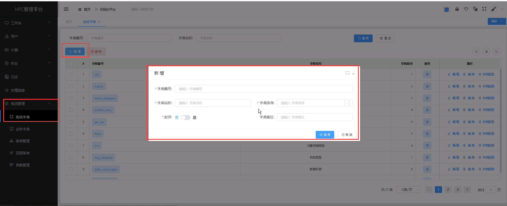
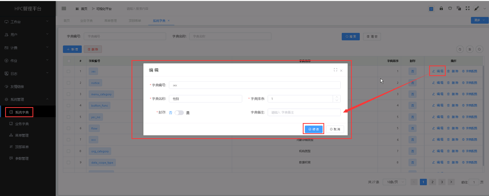
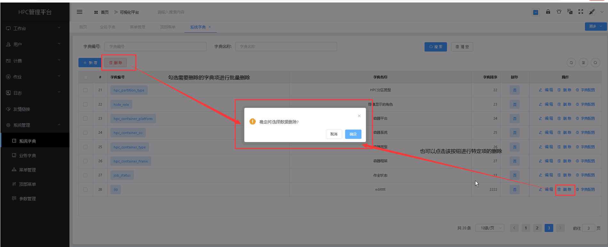
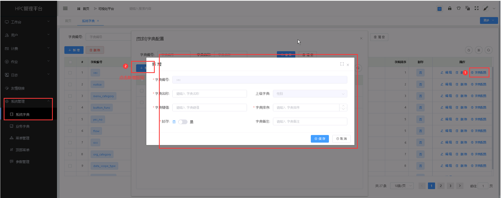
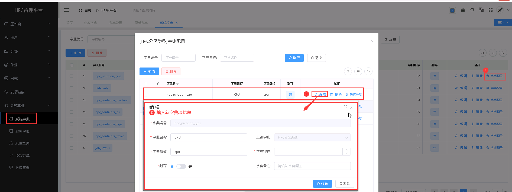
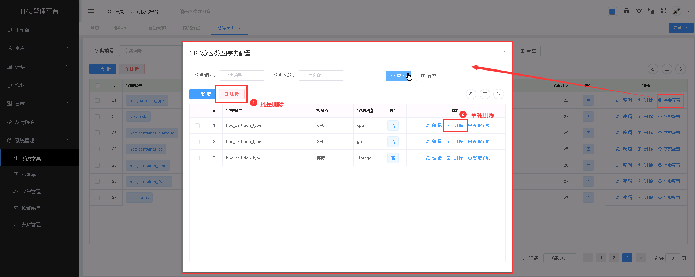

系统字典
===================================
&emsp;

+ **系统字典主要是对系统的常用项进行设置，系统中所需的字典已经做好初始配置，如果修改需要注意字典名。**

+ **系统默认字典项包括：** *计费方式*、*计费单位*、*HPC 集群列表*、*默认存储大小*、*告警通知方式*、*HPC 分区类型*、*隐藏显示的角色*，**不可更改字典编号**。

&emsp;

----------------------------------------------------------------------------------------------------------------------------------

## 新增字典 ##

* 点击【**系统管理**】菜单，再次点击[**系统字典**]，进入'系统字典'列表页面，点击<**新增**>按钮，填入字典信息，点击<**保存**>，可成功添加字典。

&emsp;

----------------------------------------------------------------------------------------------------------------------------------

## 编辑字典 ##

* 点击【**系统管理**】菜单，再次点击[**系统字典**]，进入'系统字典'列表页面，点击需要编辑的字典项中的[**操作**]列的<**编辑**>按钮，填入新的字典信息，点击<**修改**>，可成功编辑字典。

&emsp;

----------------------------------------------------------------------------------------------------------------------------------
## 删除字典 ##

* 点击【**系统管理**】菜单，再次点击[**系统字典**]，进入'系统字典'列表页面，点击需要删除的字典项中的[**操作**]列的<**删除**>按钮进行删除操作；也可以勾选需要删除的字典项，再点击<**删除**>按钮，进行批量删除的操作。

&emsp;

----------------------------------------------------------------------------------------------------------------------------------

## 新增字典子项 ##

* 点击【**系统管理**】菜单，再次点击[**系统字典**]，进入'系统字典'列表页面，点击操作中的<**字典配置**>项，点击弹窗中的<**新增**>按钮，填入字典子项信息，点击<**保存**>，可成功添加字典子项。

&emsp;

----------------------------------------------------------------------------------------------------------------------------------

## 编辑字典子项 ##

* 点击【**系统管理**】菜单，再次点击[**系统字典**]，进入'系统字典'列表页面，点击需要编辑的字典子项所在的字典项中的[**操作**]列的<**字典配置**>按钮，进入字典配置弹窗页，选择需要编辑的字典子项中的<**编辑**>按钮，填入新的字典子项信息，点击<**修改**>，可成功编辑字典子项。

&emsp;

----------------------------------------------------------------------------------------------------------------------------------

## 删除字典子项 ##

* 点击【**系统管理**】菜单，再次点击[**系统字典**]，进入'系统字典'列表页面，点击需要删除的字典子项所在的字典项中的[**操作**]列的<**字典配置**>按钮，进入字典配置弹窗页，点击<**删除**>进行删除操作；也可以勾选需要删除的字典子项，再点击<**删除**>按钮，进行批量删除的操作。

&emsp;

