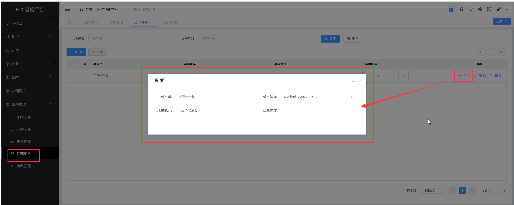

顶部菜单
===================================
&emsp;

+ **主要配置顶部显示菜单。**

## 新增顶部菜单 ##
* 点击【**系统管理**】菜单，再次点击[**顶部**]，进入'菜单'列表页面，点击<**新增**>按钮，填入顶部菜单信息，点击<**保存**>，可成功添加顶部菜单。

&emsp;

----------------------------------------------------------------------------------------------------------------------------------

## 查看顶部菜单详情 ##

* 点击【**系统管理**】菜单，再次点击[**顶部菜单**]，进入'顶部菜单'列表页面，点击需要查看的顶部菜单项中的[**操作**]列的<**查看**>按钮，可成功查看顶部菜单项详情信息。

&emsp;

----------------------------------------------------------------------------------------------------------------------------------

## 编辑顶部菜单 ##

* 点击【**系统管理**】菜单，再次点击[**顶部菜单**]，进入'顶部菜单'列表页面，点击需要编辑的顶部菜单项中的[**操作**]列的<**编辑**>按钮，填入新的顶部菜单信息，点击<**修改**>，可成功编辑顶部菜单。

&emsp;

----------------------------------------------------------------------------------------------------------------------------------

## 删除顶部菜单 ##

* 点击【**系统管理**】菜单，再次点击[**顶部菜单**]，进入'顶部菜单'列表页面，点击需要删除的顶部菜单项中的[**操作**]列的<**删除**>按钮进行删除操作；也可以勾选需要删除的顶部菜单项，再点击<**删除**>按钮，进行批量删除的操作。

&emsp;

