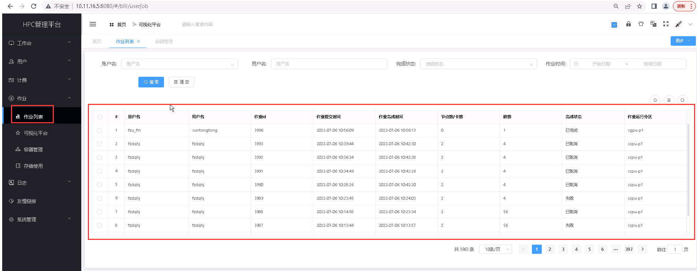
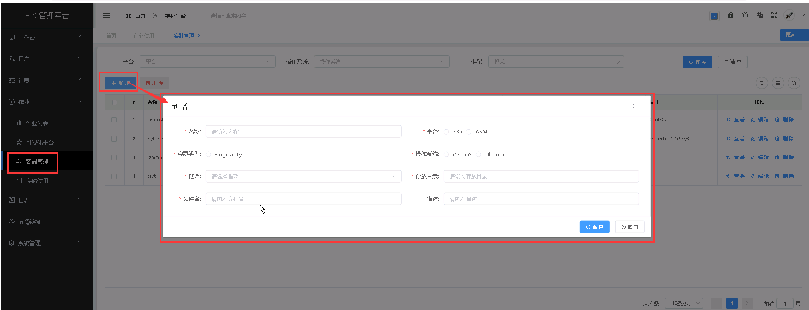
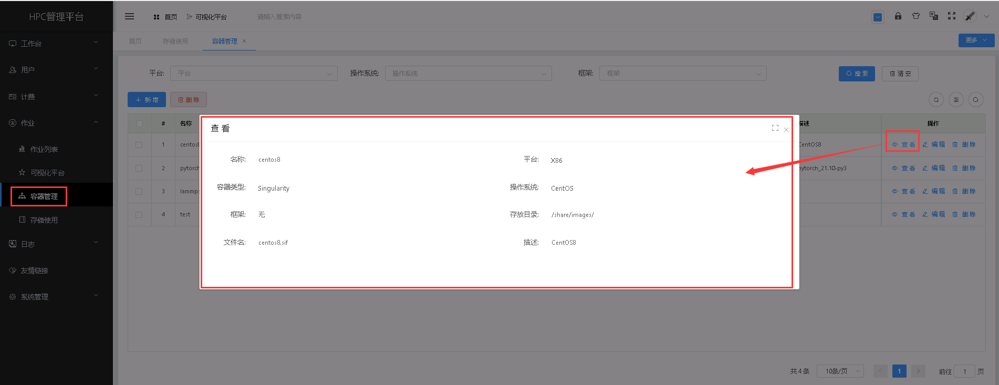
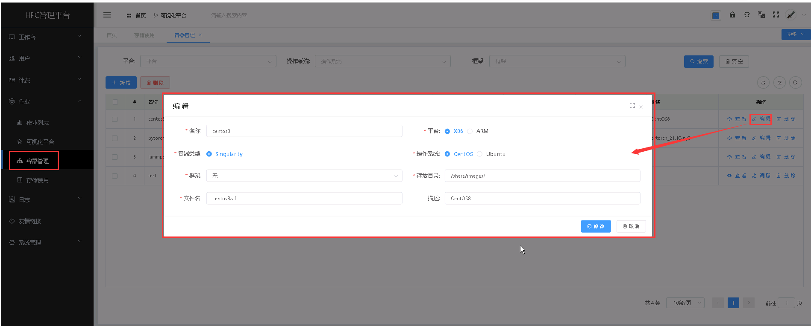
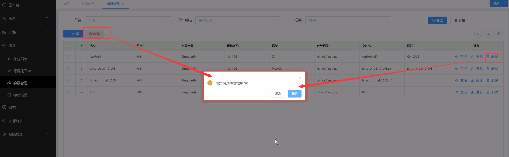
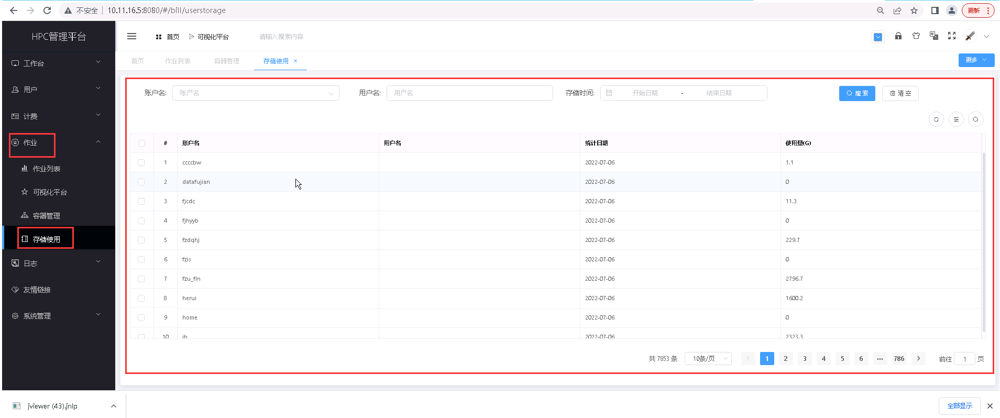

作业列表
==============================

>**每日自动获取作业作业使用详单，团队作业可以查看自己的具体使用详单，作业详单信息从 slurm 平台进行采集；账单基于此信息进行计算。**

+ 作业列表展示如下：

----------------------------------------------------------------------------------------------------------------------------------

容器管理
==============================

> **容器管理可在主机之外提供多种系统环境选择，满足运行不同软件的需要。基于容器架构搭建的HPC集群可以对HPC不同应用进校有效的隔离，解决传统HPC应用程序安装、升级以及安装包之间的依赖性等问题，让系统的部署和运维变得更加有效。**

## 新增容器 ##

* 点击【**作业**】菜单，再次点击[**容器管理**]，进入'容器管理'列表页面，点击<**新增**>按钮填入容器信息，点击<**保存**>，可成功添加容器。

&emsp;

## 查看容器详情 ##

* 点击【**作业**】菜单，再次点击[**容器管理**]，进入'容器管理'列表页面，点击需要查看的容器管理项中的[**操作**]列的<**查看**>按钮，可成功查看容器项详情信息。

&emsp;

## 编辑容器 ##

* 点击【**作业**】菜单，再次点击[**容器管理**]，进入'容器管理'列表页面，点击需要编辑的容器管理项中的[**操作**]列的<**编辑**>按钮，填入新的容器管理信息，点击<**修改**>，可成功编辑容器。

&emsp;

## 删除容器 ##

* 点击【**作业**】菜单，再次点击[**容器管理**]，进入'容器管理'列表页面，点击需要删除的容器管理项中的[**操作**]列的<**删除**>按钮进行删除操作；也可以勾选需要删除的容器管理项，再点击<**删除**>按钮，进行批量删除的操作。

&emsp;

----------------------------------------------------------------------------------------------------------------------------------

存储使用列表
==============================

> **每日自动获取账户及作业的存储使用详单，存储使用信息通过对作业目录 大小进行采集；账单基于此信息进行计算。**

