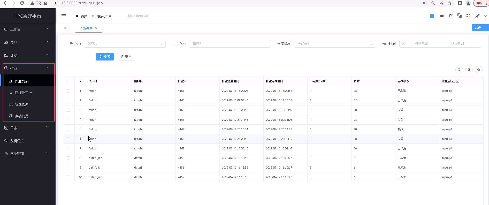

作业
===========================

..
    
    **用户可查看作业列表、进行容器管理和查看存储使用情况。具体功能包括：**

    + 用户可以在 **作业列表** 模块搜索访问平台作业详细信息；     

    + 用户可在 **容器管理** 模块进行新增、编辑和删除容器、查看容器详情的操作；

    + 用户可在 **存储使用列表** 查看账户存储使用的情况。

.. toctree::
   :maxdepth: 1
   :hidden:

   content
  