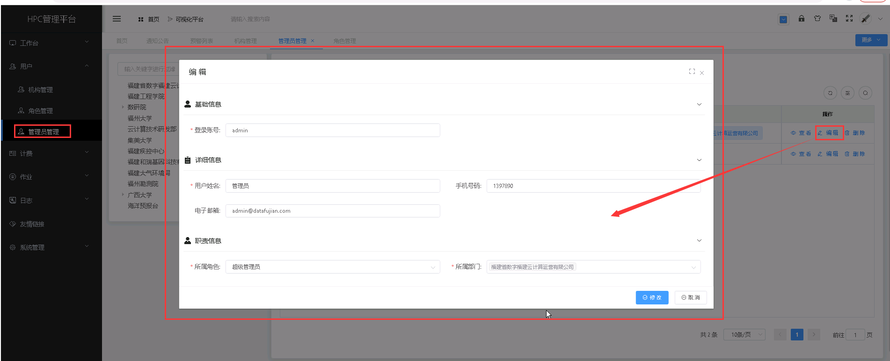

管理员
===============================

> **可针对系统管理员进行管理，新增或修改管理员信息。系统管理员仅针对系统进行管理，不提供 HPC 平台操作功能。**

## 新增管理员 ##
* 点击【**用户**】菜单，再次点击[**管理员管理**]，进入'管理员管理'列表页面，点击<**新增**>按钮，填入管理员信息，点击<**保存**>，可成功添加管理员。

&emsp;

----------------------------------------------------------------------------------------------------------------------------------

## 查看管理员详情 ##

* 点击【**用户**】菜单，再次点击[**管理员管理**]，进入'管理员管理'列表页面，点击需要查看的管理员项中的[**操作**]列的<**查看**>按钮，可成功查看管理员项详情信息。

&emsp;

----------------------------------------------------------------------------------------------------------------------------------

## 编辑管理员 ##

* 点击【**用户**】菜单，再次点击[**管理员管理**]，进入'管理员管理'列表页面，点击需要编辑的管理员项中的[**操作**]列的<**编辑**>按钮，填入新的管理员信息，点击<**修改**>，可成功编辑管理员。

&emsp;

----------------------------------------------------------------------------------------------------------------------------------

## 删除管理员 ##

* 点击【**用户**】菜单，再次点击[**管理员管理**]，进入'管理员'列表页面，点击需要删除的管理员项中的[**操作**]列的<**删除**>按钮进行删除操作；也可以勾选需要删除的管理员项，再点击<**删除**>按钮，进行批量删除的操作。

&emsp;

----------------------------------------------------------------------------------------------------------------------------------

## 配置管理员角色 ##

* 点击【**用户**】菜单，再次点击[**管理员管理**]，进入'管理员管理'列表页面，勾选需要更改的管理员项，再点击<**角色配置**>按钮，勾选目标项，点击<**确定**>，可成功编辑管理员角色权限。

&emsp;

----------------------------------------------------------------------------------------------------------------------------------

## 重置管理员密码 ##

* 点击【**用户**】菜单，再次点击[**管理员管理**]，进入'管理员'列表页面，勾选需要更改的管理员项，再点击<**密码重置**>按钮，点击<**确定**>，可成功重置管理员密码。

&emsp;
