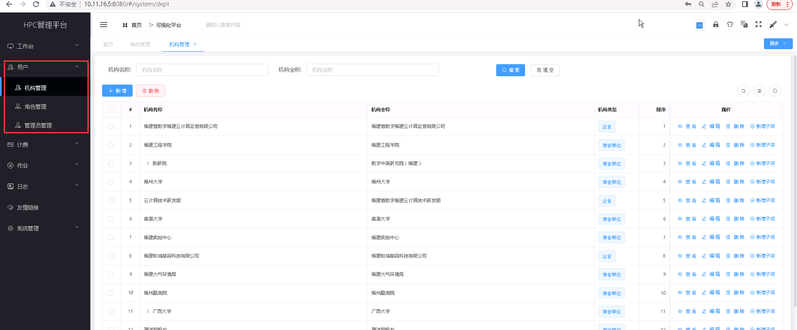

用户管理
===========================
..

   **用户管理包括对机构、角色以及管理员的管理，同时可以设置不同用户角色的菜单权限和数据权限。**

   +  **机构管理** 配置HPC平台的机构信息，系统管理员账号可新增、编辑、删除机构，查看机构详情信息，平台默认机构类型：政府部门、事业单位、科研院所、企业；

      * 点击快速访问 :doc:`./org` 模块

   +  **角色管理** 配置HPC平台的角色信息，系统管理员账户可新增、编辑和删除角色，对角色进行权限配置（包括菜单权限、数据权限和接口权限）；

      * 点击快速访问 :doc:`./role` 模块

      +  当用户配置某一角色时，该用户就拥有角色对应的权限；

      +  系统用户共划分三种角色类型，包括系统管理员、团队管理员、团队普通用户；

   +  **管理员管理** 配置HPC平台的管理员信息，可新增、编辑、删除管理员账户，可重置管理员账户密码，配置管理员账户角色等操作；
   
      * 点击快速访问 :doc:`./administrator` 模块

.. toctree::
   :maxdepth: 1
   :hidden:

   org
   role
   administrator