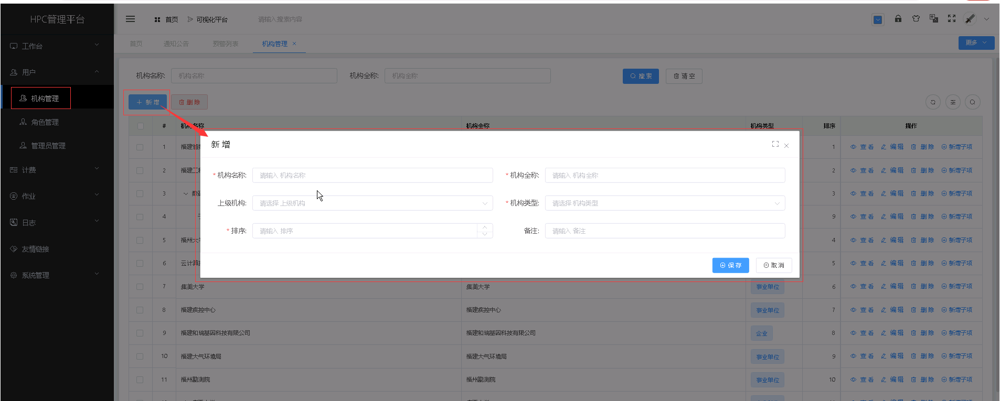

机构管理
===============================

&emsp;

+ **新增账户及用户之前，需要先添加相关的机构，支持多级机构。**

## 新增机构 ##

* 点击【**用户**】菜单，再次点击[**机构管理**]，进入'机构管理'列表页面，点击<**新增**>按钮或者点击某一机构项的操作列的<**新增子项**>，填入机构信息，点击<**保存**>，可成功添加机构或为特定机构添加子机构。

&emsp;

----------------------------------------------------------------------------------------------------------------------------------

## 查看机构管理详情 ##

* 点击【**用户**】菜单，再次点击[**机构管理**]，进入'机构管理'列表页面，点击需要查看的机构管理项中的[**操作**]列的<**查看**>按钮，可成功查看机构项详情信息。

&emsp;

----------------------------------------------------------------------------------------------------------------------------------

## 编辑机构管理 ##

* 点击【**用户**】菜单，再次点击[**机构管理**]，进入'机构管理'列表页面，点击需要编辑的机构管理项中的[**操作**]列的<**编辑**>按钮，填入新的机构管理信息，点击<**修改**>，可成功编辑机构。

&emsp;

----------------------------------------------------------------------------------------------------------------------------------

## 删除机构管理 ##

* 点击【**用户**】菜单，再次点击[**机构管理**]，进入'机构管理'列表页面，点击需要删除的机构管理项中的[**操作**]列的<**删除**>按钮进行删除操作；也可以勾选需要删除的机构管理项，再点击<**删除**>按钮，进行批量删除的操作。

