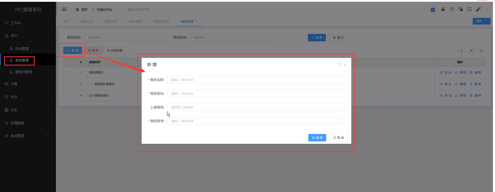
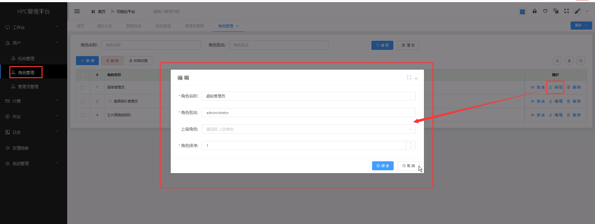
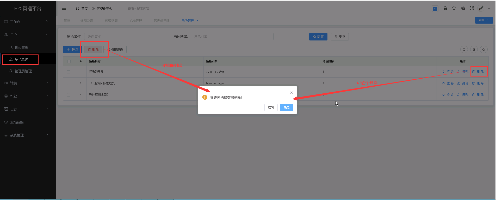
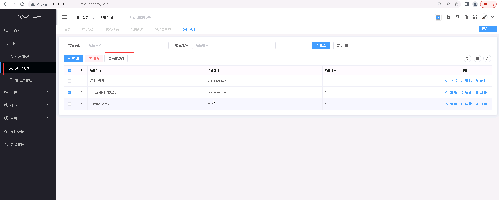
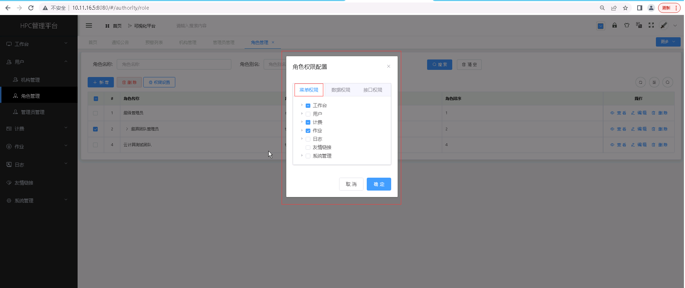
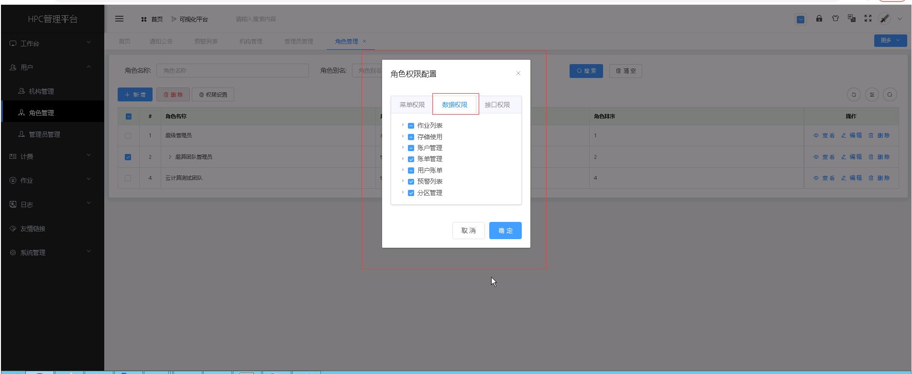

角色管理
===============================

> **可对用户角色进行管理，系统默认内置三个角色，包括：系统管理员、团队管理员和团队用户。**

## 新增角色 ##

* 点击【**用户**】菜单，再次点击[**角色管理**]，进入'角色管理'列表页面，点击<**新增**>按钮，填入角色管理信息，点击<**保存**>，可成功添加角色管理。

&emsp;

----------------------------------------------------------------------------------------------------------------------------------

## 查看角色详情 ##

* 点击【**用户**】菜单，再次点击[**角色管理**]，进入'角色管理'列表页面，点击需要查看的角色管理项中的[**操作**]列的<**查看**>按钮，可成功查看角色管理项详情信息。

&emsp;

----------------------------------------------------------------------------------------------------------------------------------

## 编辑角色 ##

* 点击【**用户**】菜单，再次点击[**角色管理**]，进入'角色管理'列表页面，点击需要编辑的角色管理项中的[**操作**]列的<**编辑**>按钮，填入新的角色管理信息，点击<**修改**>，可成功编辑角色。

&emsp;

----------------------------------------------------------------------------------------------------------------------------------

## 删除角色 ##

* 点击【**用户**】菜单，再次点击[**角色管理**]，进入'角色管理'列表页面，点击需要删除的角色管理项中的[**操作**]列的<**删除**>按钮进行删除操作；也可以勾选需要删除的角色管理项，再点击<**删除**>按钮，进行批量删除的操作。

&emsp;

## 配置角色权限 ##

> 可以设置用户角色的菜单权限以及数据权限：点击【**用户**】菜单，再次点击[**角色管理**]，进入'角色管理'列表页面，,选择需要修改权限配置的角色项，点击<**权限设置**>按钮，勾选需要的权限项，点击<**确定**>按钮进行权限配置的操作。

### 菜单权限设置：

+ **配置角色菜单项**

### 数据权限设置：

+ **配置角色数据项**

&emsp;
