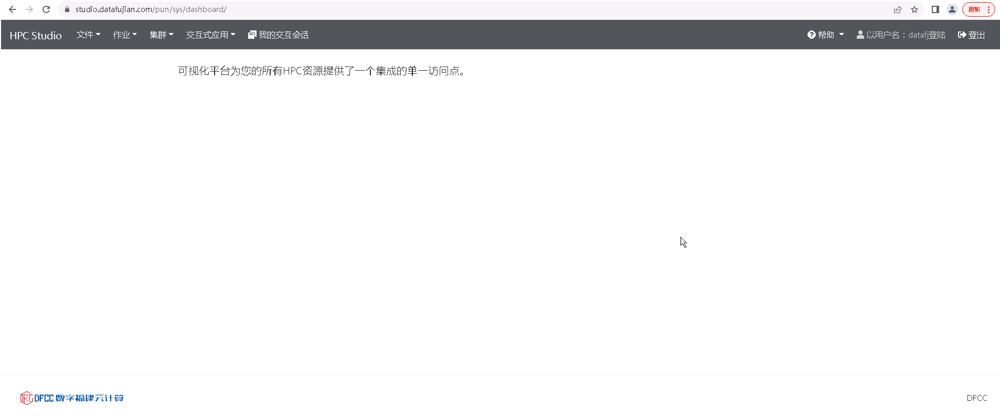

首页
======================
&emsp;

&emsp;

-----------------------------------------------------------------------------

文件管理
======================

**可在线对作业目录下文件进行管理，包括新建、 查看、删除、重命名、移动、下载、拷贝/黏贴文件等，进入其他目 录，新建目录，上传文件，显示文件信息等。**

&emsp;

&emsp;

-----------------------------------------------------------------------------

作业管理
======================

**查看队列中的作业状态及作业详情，新建作业， 编辑作业，提交作业。**

&emsp;

## 作业列表 ##

## 作业编辑器 ##

&emsp;

-----------------------------------------------------------------------------

集群管理
======================

**查看、管理集群及节点状态信息**

&emsp;

&emsp;

