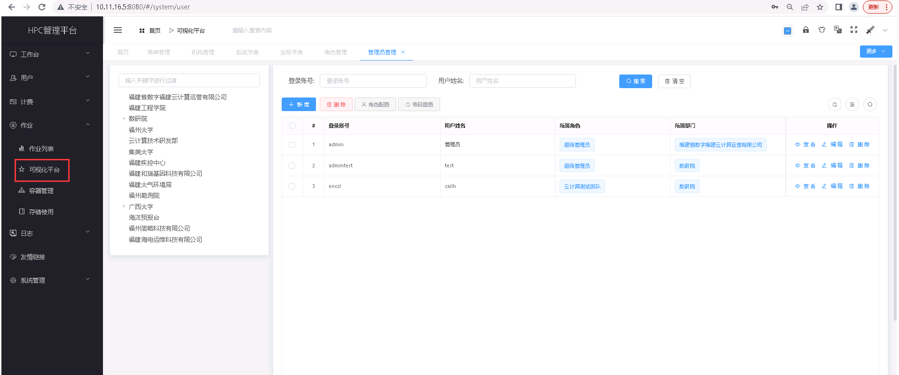

可视化平台
===========================

..

   **可视化平台主要实现对 HPC 平台的可视化使用，集成 Web Shell、文件管理、作业提交、可视化应用等一站式服务，可以在线提交与管理作业任务、在线通过命令行访问服务器等。具体功能包括：**

    * （1） **集群管理**  查看、管理集群及节点状态信息；     

    * （2） **文件管理** 可在线对作业目录下文件进行管理，包括新建、查看、删除、重命名、移动、下载、拷贝/黏贴文件等，进入其他目录，新建目录，上传文件，显示文件信息等；

    * （3） **作业管理** 查看队列中的作业状态及作业详情，新建作业，编辑作业，提交作业；

    * （4） **集成在线终端** 。

.. toctree::
   :maxdepth: 1
   :hidden:

   content