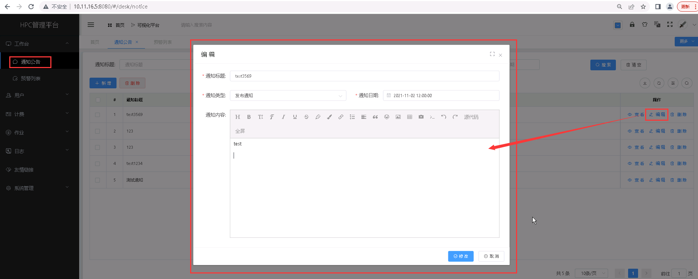

通知公告
====================================

>**可在该处添加、查看和删除、编辑通知公告。**

## 新增通知公告 ##
* 点击【**工作台**】菜单，再次点击[**通知公告**]，进入'通知公告'列表页面，点击<**新增**>按钮，填入通知公告信息，点击<**保存**>，可成功添加通知公告。

&emsp;

----------------------------------------------------------------------------------------------------------------------------------

## 查看通知公告详情 ##

* 点击【**工作台**】菜单，再次点击[**通知公告**]，进入'通知公告'列表页面，点击需要查看的通知公告项中的[**操作**]列的<**查看**>按钮，可成功查看通知公告项详情信息。

&emsp;

----------------------------------------------------------------------------------------------------------------------------------

## 编辑通知公告 ##

* 点击【**工作台**】菜单，再次点击[**通知公告**]，进入'通知公告'列表页面，点击需要编辑的通知公告项中的[**操作**]列的<**编辑**>按钮，填入新的通知公告信息，点击<**修改**>，可成功编辑通知公告。

&emsp;

----------------------------------------------------------------------------------------------------------------------------------

## 删除通知公告 ##

* 点击【**工作台**】菜单，再次点击[**通知公告**]，进入'通知公告'列表页面，点击需要删除的通知公告项中的[**操作**]列的<**删除**>按钮进行删除操作；也可以勾选需要删除的通知公告项，再点击<**删除**>按钮，进行批量删除的操作。

&emsp;

预警信息列表
====================================

> **预警信息里面包括预警阈值的设置和告警信息查看。仅管理员和团队管理员可查看。**

## 预警列表 ##

> **可按照账户进行告警信息搜索。**

&emsp;

------------------------------------------------------------

## 预警阈值设置 ##

> **管理员可以设置告警阈值。**

+ 点击【**工作台**】菜单，再次点击[**预警列表**]，进入'预警列表'列表页面，点击<**设置**>按钮，填入预警设置信息，点击<**提交**>按钮，可成功设置预警信息。

&emsp;

