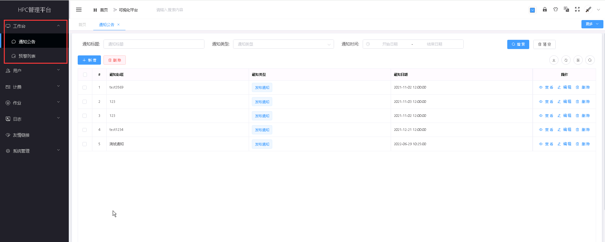

工作台
===========================

..
   
   **管理员可在工作台处查看通知公告信息和预警信息，系统管理员可在该处添加、修改和删除通知公告和设置预警参数等。其中：**

   * 系统管理员用户可为账户设置告警阈值，查看告警信息，维护告警信息等；

   * 系统管理员用户有权限在告警管理模块中为账户设置自定义的告警阈值，当账户余额达到告警阈值时，系统将发出提示信息；

   * 管理员用户有权限查询费用告警信息列表，对收到的告警信息进行详情查看；

   * 系统管理员有权限对告警信息进行维护操作，包括删除告警信息操作等。

.. toctree::
   :maxdepth: 1
   :hidden:

   content